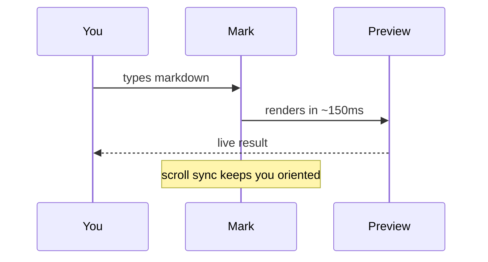

# MarkTheCrab

*Every feature Remarkable users asked for. Built in Rust.*

$$\begin{aligned}
\nabla \cdot \mathbf{E} &= \frac{\rho}{\varepsilon_0} \\
\nabla \cdot \mathbf{B} &= 0 \\
\nabla \times \mathbf{E} &= -\frac{\partial \mathbf{B}}{\partial t} \\
\nabla \times \mathbf{B} &= \mu_0\mathbf{J} + \mu_0\varepsilon_0\frac{\partial \mathbf{E}}{\partial t}
\end{aligned}$$

  

  
  

- [x] Live preview — rendered as you type, ~150 ms debounce
- [x] Scroll sync — source-map based, not the crude top-to-bottom ratio
- [x] KaTeX math — inline $E = mc^2$ and display blocks like above
- [x] Mermaid diagrams — flowcharts, sequence, Gantt, and more
- [x] Export to PDF — clean, chrome-free via system print dialog
- [x] Recent files — last 10 files, one click away
- [x] Custom CSS — scoped editor, saved with the document
- [x] Syntax highlighting — 24 languages, loaded on demand
- [x] Drag-and-drop images — auto-saved to `images/` beside your file

