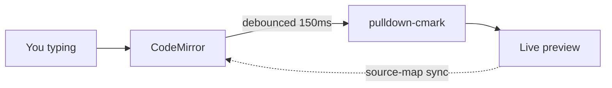
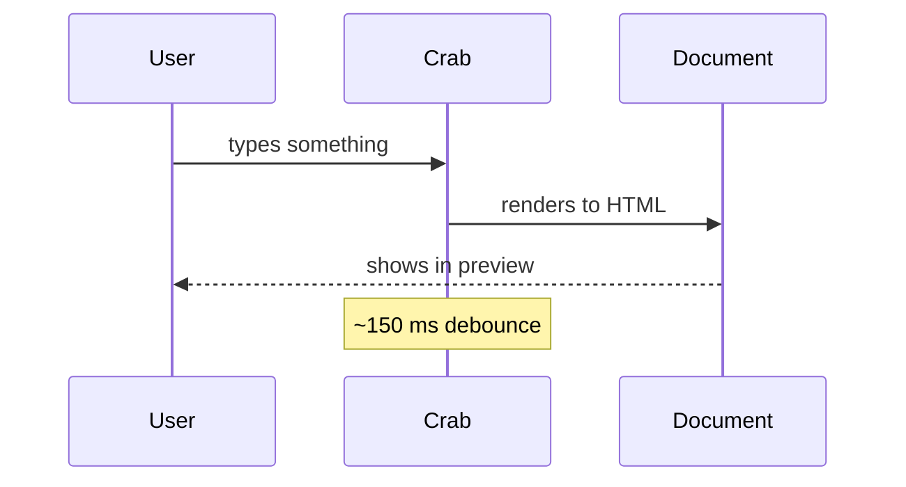

# 🦀 MarkTheCrab

> *Snip snip!* Welcome to the demo. Scroll around — what you see on the
> left is what makes the right pane happy.

[TOC]

---

## What this is

MarkTheCrab is a cross-platform markdown editor built in Rust (via
Tauri), with CodeMirror running the editor and pulldown-cmark rendering
the live preview. It's a spiritual successor to
[Remarkable](https://github.com/jamiemcg/Remarkable) — rebuilt for 2026,
with the features its users asked for and the bugs swept out.

The idea: open this file to see every feature at once. Everything on the
left is honest markdown; everything on the right is what MarkTheCrab
renders from it.

---

## Features people wanted

Pulled straight from Remarkable's issue tracker, delivered here.

### Math with KaTeX

Inline math flows right inside a sentence: $E = mc^2$ — and so does
something chunkier like $\sum_{i=1}^{n} i = \frac{n(n+1)}{2}$.

Display-mode block:

$$
\int_0^{\infty} e^{-x^2}\,dx = \frac{\sqrt{\pi}}{2}
$$

Pandoc delimiters work too: \(a^2 + b^2 = c^2\) for inline and
\[\nabla \cdot \vec{E} = \frac{\rho}{\epsilon_0}\] for display.

Or the fenced-block form, which some wikis prefer:

```katex
\overbrace{a + b + c + d}^{\text{all four terms}}
\qquad
\underbrace{x_1, x_2, \ldots, x_n}_{n\text{ crabs}}
```

### Mermaid diagrams



Sequence diagram:



### Table of contents

The `[TOC]` placeholder at the top of this doc generated the links you
saw above. Every heading gets a slugified `id`, and the TOC nests by
heading level, so deep docs stay navigable.

### Print / Export PDF

Hit **Ctrl+P** (or the printer icon in the toolbar). The system print
dialog opens — pick "Save as PDF" and you'll get a clean, chrome-free,
styled document using your current theme. No wkhtmltopdf dependency, no
font weirdness.

### Recent Files

The dropdown next to the Open button shows your ten most recent files.
Click one to jump straight in — unsaved changes still get a polite
"are you sure?" prompt first.

### Custom CSS

The `</>` toolbar icon opens a scoped CSS editor. Write selectors as if
the preview were the whole page:

```css
h1 { color: crimson; }
blockquote { border-left: 4px solid teal; padding-left: 1em; }
.toc { background: #fff8dc; }
```

The editor wraps everything in `#preview` automatically, so you can't
accidentally style the toolbar.

### Safety against losing work

- **Close the window with unsaved edits** → you're asked before your
  document vanishes.
- **Another app edits the same file while it's open here** → you're
  warned before saving over their changes.
- **Save As to an existing file** → the OS save dialog handles that.

### Scroll sync that actually works

pulldown-cmark's offset iterator lets us tag every top-level block with
its source line. The editor scroll position interpolates between those
anchors instead of using the crude top-to-bottom ratio most markdown
apps ship with. Scroll this document around — the preview should stick
with you.

### Accessibility: OpenDyslexic font

The "Default font" dropdown in the toolbar has **OpenDyslexic** as an
option. It applies to both the editor and the preview, bundled offline
under the OFL-1.1 license (see the About dialog for full text).

---

## Every markdown feature we support

### Headings

All six levels, each with an auto-generated anchor id.

# H1 is huge
## H2 is large
### H3 is standard
#### H4 is compact
##### H5 is small
###### H6 is tiny

You can link to any of them: [jump to H3](#h3-is-standard).

### Emphasis

Some words in **bold**, others in *italic*, ***both at once***, and
~~sometimes none of it at all~~.

### Custom inline extensions

The Remarkable-compatible trio:

- ==Highlighted text== for big important points
- Superscript for maths: E = mc^2^, or dates like the 1^st^
- Subscript for chemistry: H~2~O, CO~2~, C~8~H~10~N~4~O~2~

### Lists

Unordered:

- Crab claws (three, apparently)
- A fistful of sand
- The pineapple under the sea

Ordered:

1. First mate
2. Second mate
3. Third mate (promoted out of nepotism)

Nested:

- Top level
  - Second level
    - Third level
  - Back to second

Checklist (`- [ ]` / `- [x]`):

- [x] Build the Tauri shell
- [x] Port the Remarkable themes (with attribution)
- [x] Bundle OpenDyslexic
- [x] Wire KaTeX + Mermaid
- [ ] Draw the cartoon-style mascot
- [ ] Ship on iOS and Android

### Blockquote

> Rust is a good language for people who want to build things that last.
>
> — every crab who's ever used it

### Tables

Basic, with alignment:

| Feature       | Status      | Notes                                |
|:--------------|:-----------:|-------------------------------------:|
| Live preview  | working     |                                      |
| Scroll sync   | working     | source-map based, not ratio          |
| PDF export    | working     | via system print dialog              |
| iPad touch    | soon        | Tauri mobile, before commercial launch |
| Mascot icon   | in progress | SpongeBob-happy-crab energy          |

### Code blocks

Syntax-highlighted via highlight.js (24 curated languages, code-split
and loaded on demand):

```rust
fn main() {
    let greeting = "Hello from a crab!";
    for _ in 0..3 {
        println!("{greeting}");
    }
}
```

```python
def wave(n=3):
    for _ in range(n):
        print("crab says hi")
```

```bash
pnpm install
pnpm tauri dev
```

### Links

Named link: [KaTeX's function reference](https://katex.org/docs/supported.html)
for when you want to get fancy.

Bare autolink (no angle brackets needed): visit
https://commonmark.org/help/ for a CommonMark cheat sheet.

### Images


The image above is probably broken until you draw the mascot. Try
dragging any PNG into the editor — MarkTheCrab saves it to an
`images/` folder next to the document and inserts a link automatically.
Path is URL-encoded so filenames with spaces survive.

### Horizontal rule

---

Three dashes on their own line, with blank lines around them. Used
throughout this doc.

### Footnotes

This sentence has a footnote[^1], and here's another one[^crab].

[^1]: A plain numeric-style footnote.
[^crab]: A named footnote. Crabs know how to cite things.

### Smart punctuation

- Hyphen-and-en: Q4 2025--Q2 2026 becomes an en dash.
- Hyphen-and-em: "well---I'd call that clever" becomes an em dash.
- "Smart quotes" and 'single ones' and it's auto-curled, too.

### Inline HTML

Some allowed tags pass through unmodified — for example a
<kbd>Ctrl</kbd>+<kbd>P</kbd> shortcut, or
<details><summary>a collapsible section</summary>
with a surprise inside (click the triangle).
</details>

Anything script-shaped gets sanitized by ammonia on the Rust side.

---

## Wrapping up

That's the whole kit. Close this file and start your own, or keep it
around as a reference.

If you break something and want to see how it's supposed to look, this
file lives at `SHOWCASE.md` in the repo root.

🦀 *— MarkTheCrab*
